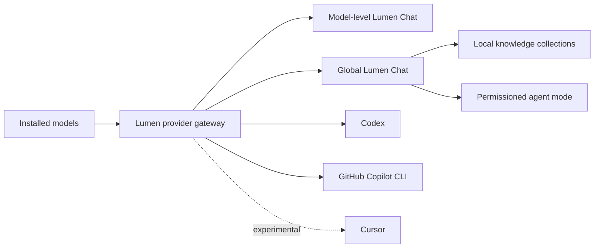

# Lumen Chat, integrations, knowledge, and agent implementation plan

Status: Draft for product and engineering review

External integration contracts reviewed: 2026-08-03

## Product decisions

This plan incorporates the following decisions:

- **Lumen Chat** replaces the current model-level **Chat** name and experience.
- Every model detail page has a **Lumen Chat** tab. Models that cannot chat show
  a clear compatibility explanation instead of hiding the tab.
- The primary left navigation gains **Lumen Chat**. It opens the full chat
  workspace rather than a particular model detail page.
- The full workspace lets the user choose an installed model and save a default
  chat model. A model-level Lumen Chat tab opens the same workspace with that
  model selected; it is not a second chat implementation.
- Every model detail page gains an **Integration** tab with **Add in Codex**,
  **Add in Copilot**, and **Add in Cursor** actions.
- The Integration tab exposes exactly those three actions initially, but its
  cards, compatibility rules, and setup flows are data-driven. Adding future
  integrations must not require redesigning the tab or duplicating its common
  connection and review UI.
- Integration actions show the exact endpoint, model identifier,
  authentication, protocol, and proposed configuration before changing or
  launching another tool.
- Codex and Copilot are compatibility-gated by protocol and model capability.
  Cursor is labeled experimental until its installed version exposes a stable,
  documented custom-endpoint path.
- Lumen Source remains local-first. Prompts, responses, documents, tool output,
  and credentials are excluded from telemetry and lifecycle logs.

## Desired outcome

> Install a model once, then use it in Lumen Chat or a supported external tool.



The phases are dependent: integrations need a reliable provider contract;
knowledge needs durable conversations and embeddings; agent mode needs richer
message types, capability validation, permissions, and recovery.

## Current baseline

Lumen Source does not start from zero:

- The sharing gateway already exposes authenticated `GET /v1/models`,
  `POST /v1/chat/completions`, and `POST /v1/embeddings` routes.
- The gateway maps stable public model aliases to Ollama or vLLM backend model
  identifiers.
- Model chat already supports streamed text and cancellation through Tauri.
- The catalog already carries capability tags such as `chat`, `code`, `tools`,
  `vision`, and `embeddings`, plus context-window information.
- Runtime entries already distinguish chat and embedding support.
- Secrets already use the operating-system credential store.

Important gaps in the baseline:

- The gateway reads the complete upstream response before returning it, so SSE
  is not actually streamed through the gateway.
- There is no `/v1/responses` route. Current Codex custom providers use the
  Responses protocol; Chat Completions alone is insufficient.
- The current frontend chat is session-only, text-only, tied to a model detail
  page, and limited to `user` and `assistant` messages.
- Chat cancellation is global rather than scoped to a request or conversation.
- Catalog claims are not yet combined with runtime probes into a user-facing
  compatibility result.
- The provider gateway runs only while Lumen Source runs. Closing the process
  disconnects integrations.

## Shared architecture and contracts

### One chat domain, two entry points

Build one `LumenChatWorkspace` and one conversation service.

- **Left navigation:** opens the workspace with the last-used/default model.
- **Model detail > Lumen Chat:** opens the workspace with that model selected.
- Changing the model for a conversation is explicit. Existing messages remain
  attached to the conversation and the change is recorded in conversation
  metadata.
- Removing a model does not delete conversations. The conversation becomes
  unavailable until the user selects another compatible model.

This avoids divergent behavior, storage, and privacy rules between “global”
and model-level chat.

### Provider API

Use the existing gateway as the foundation for a stable provider API:

- `GET /v1/models`
- `POST /v1/chat/completions`
- `POST /v1/responses`
- `POST /v1/embeddings`
- SSE streaming for Chat Completions and Responses
- bearer authentication, including on loopback
- stable public model aliases independent of runtime-specific identifiers
- explicit capability metadata as additive `lumen_source_*` model fields
- bounded request sizes, timeouts, cancellation, and normalized errors

LAN exposure remains opt-in. Integration setup may enable the gateway on
loopback and expose the selected model, but it must not enable LAN access or
change firewall/router settings.

### Capability result

Introduce a normalized capability result per installed entry:

```text
chat | reasoning | code | tools | vision | embeddings | fim | responses
```

Each result records:

- catalog claim;
- runtime support;
- last compatibility probe and timestamp;
- context window;
- status: `verified`, `claimed`, `unsupported`, or `failed`;
- a short user-facing reason.

External integrations use verified capabilities where the tool requires them.
For example, Copilot CLI requires streaming and tool calling; Codex additionally
requires a compatible Responses route. A general chat model must not be
advertised automatically as a coding-agent model.

### Persistent data

Keep these concerns separate:

- application settings: default chat model, history preference, gateway state;
- conversations: versioned conversation metadata and messages;
- documents: source metadata, extracted text, chunks, and index references;
- secrets: operating-system credential store only;
- logs/telemetry: outcomes and coarse counts only, never content.

Conversation records need stable UUIDs, an independent schema version, atomic
writes, backup recovery, and retention/deletion controls. Do not append chat
content to the existing model inventory or lifecycle logs.

The initial conversation contract should reserve support for `system`, `user`,
`assistant`, and `tool` roles even if the first UI only creates the first three.
Messages also need stable IDs, timestamps, generation status, model snapshot,
and optional attachment/source/tool metadata.

### Likely repository touchpoints

| Area | Existing starting point | Planned direction |
| --- | --- | --- |
| Navigation | `App.tsx`, `sidebar-navigation` styles | Add `lumenChat` section and shared workspace routing |
| Model tabs | `ModelDetails.tsx`, `DetailTab` | Rename Chat, always render it, add `integration` |
| Chat frontend | `useModelChat.ts`, `ChatPanel` | Split reusable workspace/state from presentation |
| Tauri commands | `commands.ts`, Rust `commands.rs` | Conversation/request IDs, scoped cancellation, integration commands |
| Provider | Rust `sharing.rs` | Streaming protocol gateway with Responses support |
| Backend orchestration | Rust `bridge.rs` | Conversation service, capability probes, request ownership |
| Settings | Rust/TypeScript `ApplicationSettings` | Schema migration for chat/provider defaults |
| Persistence | Rust `storage.rs` and atomic state helpers | Separate versioned conversation and knowledge stores |
| Capabilities | Catalog schema and runtime capabilities | Claimed plus probed compatibility result |
| Secrets | `credential_store.rs` | Continue OS-store-only token handling |
| Copy and labels | `locales/en.ts` | Lumen Chat and Integration terminology |

Every new persisted settings field requires synchronized Rust and TypeScript
types, a `SETTINGS_SCHEMA_VERSION` migration, validation, backup/restore
coverage, and reset behavior. Conversation and knowledge schemas should remain
independent from the application-settings schema.

## Phase 1 — Use this model in other tools

### Goal

Make Lumen Source a dependable OpenAI-compatible provider and add the
model-level **Integration** tab.

### 1.1 Gateway hardening

1. Refactor the gateway into protocol routing, authentication, model routing,
   and backend-adapter layers.
2. Stream upstream response bodies instead of buffering them. Preserve the
   relevant SSE headers and stop the upstream request when the client
   disconnects.
3. Pass Chat Completions messages, tool definitions, tool choices, structured
   output fields, and tool-call deltas without discarding unknown compatible
   fields.
4. Add `/v1/responses`:
   - proxy directly when the backend has verified Responses support;
   - otherwise translate only the explicitly supported subset to/from Chat
     Completions;
   - reject unsupported Responses features with a precise OpenAI-style error;
   - cover input items, output items, function calls/results, reasoning-item
     handling, SSE events, usage, cancellation, and error mapping.
5. Keep `/v1/models` aliases stable across runtime upgrades. Include additive
   Lumen capability metadata without requiring clients to understand it.
6. Add gateway health and compatibility commands for the desktop UI.
7. Reuse the existing credential-store token. Integration actions can rotate
   or reveal a new token only after explicit confirmation.
8. Make lifecycle behavior explicit: integrations work while Lumen Source is
   running. Evaluate tray/background behavior before promising an always-on
   provider.

### 1.2 Compatibility probes

Add deterministic, bounded probes for:

- model listing and alias resolution;
- non-streaming and streaming chat;
- cancellation;
- embeddings where claimed;
- tool-call shape and tool-result continuation;
- Responses streaming where required;
- vision input later, before enabling image attachment;
- context-window metadata consistency.

Store probe outcomes and timestamps, not prompts or generated content.

### 1.3 Integration tab

Add `integration` to the model detail tab type and render **Integration** for
every model. The page contains three integration cards and a common connection
summary:

Treat Codex, Copilot, and Cursor as the initial entries in an extensible
integration registry, not as hard-coded layout branches. The registry owns the
label, compatibility requirements, status, configuration fields, and setup
flow for each tool so more integrations can be added without changing the tab
structure.

- provider status;
- base URL;
- public model ID;
- authentication requirement;
- supported protocol;
- verified capability badges;
- **Test connection** and copy controls.

An action opens a review dialog before making changes. The dialog shows files,
environment variables, commands, backups, and limitations. Writes must be
idempotent and recoverable.

#### Add in Codex

Target Codex CLI/IDE local configuration, not Codex cloud.

Current Codex custom model providers use the Responses protocol. Generate a
separate profile file rather than overwriting the user's base configuration:

```toml
# ~/.codex/lumen-<model-slug>.config.toml
model = "<lumen-public-model-id>"
model_provider = "lumen_source"

[model_providers.lumen_source]
name = "Lumen Source"
base_url = "http://127.0.0.1:<port>/v1"
env_key = "LUMEN_SOURCE_API_KEY"
wire_api = "responses"
```

Show these fields:

- profile name and path;
- provider ID (`lumen_source`);
- model ID;
- base URL;
- token environment variable (`LUMEN_SOURCE_API_KEY`);
- wire API (`responses`);
- launch command: `codex --profile lumen-<model-slug>`;
- Responses/tool compatibility result.

Do not write a bearer token into TOML. For a one-click launch, inject the token
only into the child process environment. For manual use, provide
platform-specific copyable environment setup instructions. Back up an existing
same-name profile before replacement and offer **Remove integration**.

Disable installation when Responses compatibility has not passed. A direct
`codex --oss --local-provider ollama` command can be shown as an Ollama-only
fallback, but it bypasses the unified Lumen provider and is not the primary
integration.

#### Add in Copilot

Phase 1 targets **GitHub Copilot CLI**. Do not claim replacement of VS Code
inline completion or every Copilot surface.

Show and test:

```text
COPILOT_PROVIDER_TYPE=openai
COPILOT_PROVIDER_BASE_URL=http://127.0.0.1:<port>/v1
COPILOT_PROVIDER_API_KEY=<Lumen token>
COPILOT_MODEL=<lumen-public-model-id>
COPILOT_OFFLINE=true  # optional, only when every provider is local
```

The card includes:

- model/tool/streaming compatibility result;
- copyable PowerShell, Bash, and fish commands;
- **Launch Copilot** with process-local environment variables when the CLI is
  detected;
- an explicit choice before making variables persistent;
- a warning that setting `COPILOT_OFFLINE=true` is only appropriate when the
  configured endpoint is local.

Do not patch arbitrary shell startup files in the MVP.

#### Add in Cursor

Keep this card **Experimental**. Cursor's public API-key documentation covers
standard chat models but does not establish a durable arbitrary local-provider
configuration contract for all features.

The action should therefore:

- detect the installed Cursor version when possible;
- show the model ID, OpenAI-compatible base URL, and API token fields;
- provide manual steps only if that Cursor version exposes a base-URL override;
- explain that Cursor Tab and specialized/agent features may continue to use
  Cursor-hosted models;
- avoid editing undocumented Cursor state files;
- offer **Test endpoint** from Lumen Source, not claim that Cursor itself is
  configured successfully without a Cursor-side verification.

If the installed version has no supported custom endpoint path, keep the
button visible but show **Not available in this Cursor version** with copyable
connection details.

### Phase 1 acceptance gate

- Gateway SSE delivers the first delta before generation completes.
- Disconnect and explicit cancellation stop upstream work.
- Tool calls round-trip through Chat Completions without field loss.
- The supported Responses subset passes fixtures and a real compatible model.
- Aliases remain stable after restart, rename, and runtime upgrade.
- Integration setup never enables LAN sharing implicitly.
- Codex profile creation is previewed, backed up, idempotent, testable, and
  removable.
- Copilot CLI launches with process-local configuration and completes a
  verified tool call on a compatible model.
- Cursor is never presented as fully supported without an observed compatible
  configuration path.
- Prompts, responses, tokens, and tool arguments do not appear in logs,
  diagnostics, or telemetry.

## Phase 2 — Native Lumen Chat

### Goal

Replace the current Chat playground with a useful, persistent private chat
application built into Lumen Source.

### 2.1 Navigation and shared workspace

1. Add `lumenChat` to the main application section and place **Lumen Chat** in
   the left navigation, near Models.
2. Rename the current detail tab and all user-facing “Chat” references to
   **Lumen Chat** where they refer to the product UI. Keep protocol terms such
   as “Chat Completions” unchanged.
3. Always render the model-level Lumen Chat tab. Unsupported models show why
   and suggest compatible installed models.
4. Implement one `LumenChatWorkspace` used by both entry points.
5. Add a model picker containing installed chat-capable entries, runtime state,
   location, capability badges, and context size.
6. Persist `defaultModelEntryId` and `lastUsedModelEntryId` through a settings
   schema migration.
7. Reuse resource-start planning. If a chosen model is stopped, show the exact
   start/conflict plan before sending rather than failing after composition.
8. Extend unsaved-settings navigation protection and wizard-disabled behavior
   to the new section.
9. Redesign the responsive top-navigation layout for five destinations; the
   current narrow layout assumes three columns and must not wrap unpredictably.

### 2.2 Conversation MVP

Implement:

- streaming Markdown with sanitized rendering and syntax-highlighted code;
- new, rename, delete, search, and clear conversation actions;
- durable local history with a **Do not save this chat** option;
- system-prompt presets and a per-conversation editable system prompt;
- model and parameter selection with inherited model defaults shown clearly;
- stop, regenerate, edit-and-resend, and retry;
- copy message/code and export a conversation as Markdown or JSON;
- keyboard navigation, screen-reader announcements, reduced motion, and long
  transcript virtualization;
- visible token/context estimates and a clear truncation/compaction policy.

Move request ownership from the current model-scoped React hook into a chat
service keyed by `conversationId` and `requestId`. Cancellation must target a
specific request, and late events must not mutate a newer generation.

### 2.3 Attachments and richer capabilities

After the text MVP is stable:

- add image attachment only for vision-verified models;
- validate type and size before crossing the Tauri boundary;
- strip metadata where practical and show exactly what will be sent;
- keep file references and derived thumbnails in private application data;
- support structured output/reasoning presentation only when verified.

Document/PDF attachment for retrieval belongs to Phase 3 rather than being
silently pasted into the context window.

### Phase 2 acceptance gate

- Left-nav and model-level entry points open the same conversations and state.
- Every model has a Lumen Chat tab with either the workspace or a useful
  compatibility state.
- Default-model migration and missing/deleted-model recovery are tested.
- Conversations survive restart and recover from an interrupted atomic write.
- Stop/regenerate/edit-and-resend cannot mix events between requests.
- Markdown cannot execute model-produced HTML or scripts.
- Unsaved chats leave no conversation content after closing.
- History deletion removes messages and attachments within the documented
  retention boundary.
- No content is added to lifecycle logs, diagnostics, or telemetry.

## Phase 3 — Documents and personal knowledge

### Goal

Let users ask cited questions over local documents without sending document
content to a remote service unless they deliberately select a remote model.

### 3.1 Knowledge collections

Add:

- collections with names, descriptions, and local storage locations;
- PDF, plain text, Markdown, and selected office-document ingestion;
- extraction status, failures, re-index, and delete controls;
- explicit per-conversation collection selection;
- local full-text search alongside vector retrieval;
- source citations that open the original file and location where possible.

### 3.2 Embedding pipeline

1. Select or install a catalog model with verified embeddings support.
2. Store the embedding model ID, revision, chunking strategy, and dimensions
   with every index so upgrades cannot silently corrupt retrieval.
3. Extract and normalize text locally, with bounded worker concurrency.
4. Chunk deterministically and support incremental re-indexing by content hash.
5. Keep metadata and vector storage behind an abstraction selected through a
   short storage spike; prefer an embedded, transaction-safe local store.
6. Retrieve a bounded set of passages and include citation IDs in the Lumen
   Chat request.
7. Make deletion auditable: source deletion, index deletion, conversation
   citations, and original user files are separate scopes.

### 3.3 Privacy and hostile-content handling

- Show when a selected chat or embedding model is remote before uploading any
  document content.
- Treat retrieved document text as untrusted data, not system instructions.
- Cap extraction size, archive expansion, page count, chunk count, and index
  growth.
- Do not execute macros, embedded files, links, or document scripts.
- Exclude document names, paths, text, embeddings, and citations from
  telemetry and default diagnostic exports.

### Phase 3 acceptance gate

- Supported formats index and retrieve deterministically on Windows and Linux.
- Answers cite the retrieved source and location; absent support is stated
  rather than fabricated.
- Re-indexing an unchanged document is idempotent.
- Embedding-model changes trigger an explicit re-index plan.
- A malicious document cannot invoke tools or override system instructions.
- Collection and index deletion obey the displayed scope without deleting the
  user's original file unless separately requested.

## Phase 4 — Permissioned agent mode

### Goal

Add an optional agent loop for models that pass tool-use validation. Ordinary
Lumen Chat remains available and is the default.

### 4.1 Agent runtime

Build a backend-owned state machine:

1. assemble messages and allowed tool schemas;
2. request a model response;
3. validate tool-call structure and limits;
4. classify the requested action against permissions;
5. request user approval when required;
6. execute in the narrowest available sandbox;
7. return bounded tool output;
8. repeat until final answer, cancellation, step limit, or failure.

Persist resumable run state and an audit trail of approvals/actions. Do not put
secret values or unrestricted tool output into general logs.

### 4.2 Tools and permissions

Deliver tools in increasing-risk groups:

1. read-only workspace file listing, reading, and search;
2. MCP servers with explicit enablement and per-server tool visibility;
3. proposed file writes with diff preview and rollback;
4. bounded terminal commands with working-directory, timeout, output, and
   environment controls;
5. web retrieval with host policy;
6. browser/desktop control only as a later separately reviewed project.

Permission choices include **Allow once**, narrowly scoped **Allow for this
run**, and **Deny**. Destructive operations, credential access, broad directory
access, and network expansion never inherit permission from a weaker action.

### 4.3 Model qualification

Agent mode is enabled only after deterministic evaluation of:

- valid tool selection and arguments;
- tool-result continuation;
- refusal to invent unavailable tools;
- instruction hierarchy under hostile tool/document output;
- context-window and recovery behavior;
- stop/step limits and malformed-call handling.

Show **Verified for agent mode**, **Experimental**, or **Not compatible** with
the last evaluation version. Catalog tags alone are not sufficient.

### Phase 4 acceptance gate

- The default remains non-agent Lumen Chat.
- No tool runs before policy evaluation and any required approval.
- Cancellation stops model and tool work and leaves resumable state.
- Step, time, output, and context limits terminate loops safely.
- File writes have preview and recovery; destructive actions remain explicit.
- MCP and terminal permissions are scoped and revocable.
- Hostile tool output cannot silently change permissions or tool availability.
- The audit view explains what ran without exposing stored credentials.

## Cross-phase engineering work

### Testing

- Unit tests for schema migrations, alias routing, compatibility decisions,
  protocol translation, persistence, and permission policy.
- Golden JSON/SSE fixtures for Chat Completions, Responses, tools, usage,
  cancellation, malformed streams, and backend errors.
- Integration tests with dummy chat, tool, embedding, and hostile-content
  runtimes so CI does not depend on downloading a real model.
- Contract tests against supported Ollama and vLLM versions.
- End-to-end desktop tests for navigation, model selection, chat recovery,
  integration preview/rollback, and accessibility.
- Clean-machine validation on Windows and Ubuntu for Codex and Copilot CLI;
  version-specific exploratory evidence for Cursor.

### Security and privacy review

Each phase requires threat-model updates covering:

- loopback/LAN binding and bearer-token handling;
- cross-origin browser access and allowed origins;
- configuration-file writes and backups;
- prompt/document persistence and deletion;
- remote model disclosure boundaries;
- Markdown and attachment parsing;
- retrieval prompt injection;
- agent tools, sandboxes, approvals, and secret redaction.

### Documentation and telemetry

- Update the user guide and current implementation at each shipped increment.
- Keep protocol names distinct from the Lumen Chat product name.
- Document that external integrations stop when Lumen Source exits unless a
  future background mode is enabled.
- Add only aggregate outcomes such as gateway request success, chat generation
  success, indexing success, and agent run outcome. Never record content,
  paths, filenames, tool arguments/output, endpoints containing credentials,
  or tokens.

## Suggested delivery increments

| Increment | User-visible result | Dependency |
| --- | --- | --- |
| 1A | Real streaming gateway, stable aliases, compatibility status | Existing gateway |
| 1B | Chat Completions tools and Copilot CLI integration | 1A |
| 1C | Responses compatibility and Codex integration | 1A–1B |
| 1D | Experimental Cursor setup assistant | 1A |
| 2A | Renamed model-level Lumen Chat using shared service | 1A |
| 2B | Left-nav Lumen Chat, model picker, durable conversations | 2A |
| 2C | Markdown, presets, search, export, regenerate/edit | 2B |
| 2D | Vision attachments for verified models | 2C + capability probes |
| 3A | Collections, extraction, embedding-model management | 2B |
| 3B | Retrieval, citations, re-index and deletion workflows | 3A |
| 4A | Read-only tools and MCP with approvals | 1C + 2C |
| 4B | Previewed file writes and bounded terminal tools | 4A |

Phase 1 and the chat storage foundation can be developed in parallel after the
shared contracts are agreed, but Codex enablement must wait for verified
Responses compatibility.

## Decisions required before implementation

1. Should closing the window exit Lumen Source, or keep the provider available
   in a tray/background process?
2. Should enabling an integration automatically enable the loopback gateway
   and expose that model after confirmation?
3. Should conversation history be enabled by default, or explicitly opted in
   on first use?
4. Should state backup export include conversations and knowledge indexes, or
   exclude them by default because they contain private content?
5. Is Copilot scope explicitly Copilot CLI for the first release?
6. Is the experimental/manual limitation acceptable for the required **Add in
   Cursor** action?
7. Which Responses features form the first supported subset for Codex, and
   which models/runtimes are release-qualified against it?
8. Should agent mode ship behind an experimental flag until the permission and
   model-evaluation campaign is complete?

## External configuration references

- [Codex advanced configuration](https://developers.openai.com/codex/config-advanced)
  and configuration reference: custom providers use a base URL, environment
  key, and Responses wire API; current profiles are separate config files.
- [GitHub Copilot CLI BYOK](https://docs.github.com/en/enterprise-cloud@latest/copilot/how-tos/copilot-cli/customize-copilot/use-byok-models):
  OpenAI-compatible endpoints use provider environment variables and require a
  model ID; coding use requires streaming and tool calling.
- [Cursor API keys](https://docs.cursor.com/settings/api-keys): custom API keys
  apply to standard chat models, while specialized features such as Tab remain
  on Cursor's built-in models.

These external contracts are version-sensitive. Integration templates and
compatibility tests must carry a reviewed-at version/date and be revalidated
before each release.
